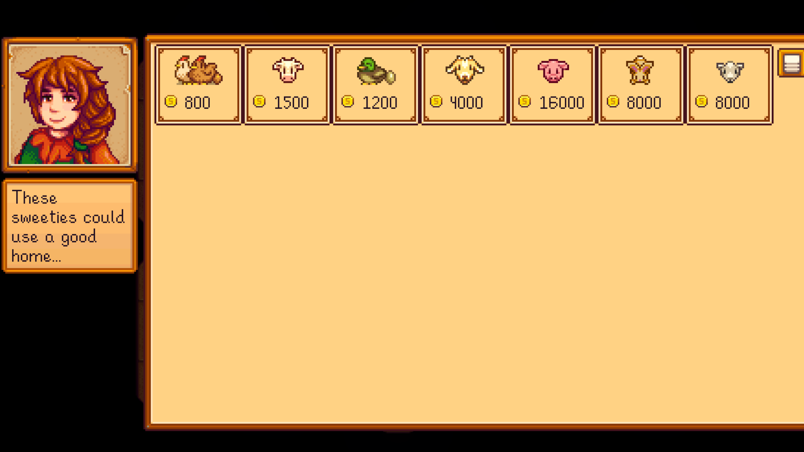

# Self Checkout

Allows you to access shops without the owner being nearby.

## Table of Contents

- [Self Checkout](#self-checkout)
  - [Table of Contents](#table-of-contents)
  - [Configurations](#configurations)
  - [Features](#features)
  - [Translations](#translations)

## Configurations

For ease of use, it is recommended to set config options
from [Generic Mod Config Menu](https://www.nexusmods.com/stardewvalley/mods/5098).

## Features

Access shop without the owner being present.

(You can optionally require a minimum heart level.)

Compatible with Livestock Bazaar.

Also should be compatible with most mods that add shops including Stardew Valley
Expanded, Ridgeside Village, and Easte Scarpe!

## Translations

❌️ = Not Translated, ❔ = Incomplete, ✔️ = Complete

|            |         Self Checkout          |
| :--------- | :----------------------------: |
| Chinese    | [❌️](SelfCheckout/i18n/zh.json) |
| French     | [❌️](SelfCheckout/i18n/fr.json) |
| German     | [❌️](SelfCheckout/i18n/de.json) |
| Hungarian  | [❌️](SelfCheckout/i18n/hu.json) |
| Italian    | [❌️](SelfCheckout/i18n/it.json) |
| Japanese   | [❌️](SelfCheckout/i18n/ja.json) |
| Korean     | [❌️](SelfCheckout/i18n/ko.json) |
| Portuguese | [❌️](SelfCheckout/i18n/pt.json) |
| Russian    | [❌️](SelfCheckout/i18n/ru.json) |
| Spanish    | [❌️](SelfCheckout/i18n/es.json) |
| Turkish    | [❔](SelfCheckout/i18n/tr.json) |